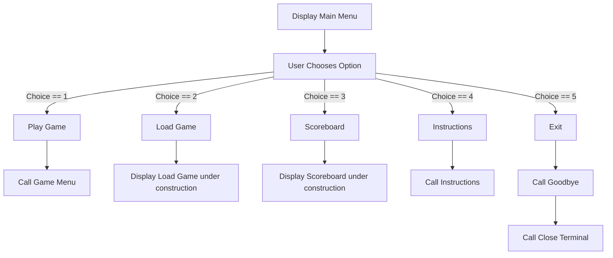
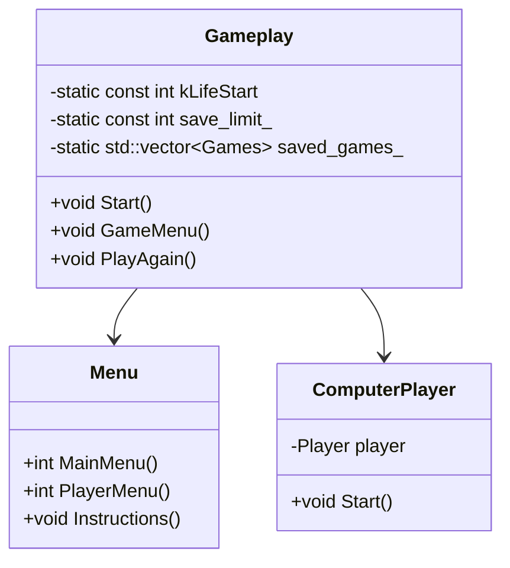

# Mastermind Game

## Table of Contents

- [Introduction](#introduction)
- [What I Used](#what-i-used)
  - [Technologies](#technologies)
  - [Others](#others)
- [Setup and Run](#setup-and-run)
- [Features](#features)
- [Development](#development)
- [Installation](#installation)

## Introduction

Mastermind is a console-based puzzle game where players decipher a secret code.

Whether you're looking for a quick mental workout or a fun way to pass the time... Mastermind provides a unique way to test your deductive skills!

## What I Used

### Technologies

- [VS Code](https://code.visualstudio.com/)
- C++17
- [CMake](https://cmake.org/)
- Enet -- soon!
- [SonarCloud](https://sonarcloud.io/)
- [cURL](https://curl.se/libcurl/c/)

### Others

- [ASCIIDecorator](https://marketplace.visualstudio.com/items?itemName=helixquar.asciidecorator)
- [clangd](https://marketplace.visualstudio.com/items?itemName=llvm-vs-code-extensions.vscode-clangd)
- [Google C++ Style Guide](https://google.github.io/styleguide/cppguide.html)
- [Random Integer Generator](https://www.random.org/clients/http/api/)

## Setup and Run

## Features

### Activity Diagram

### Class Diagram

## Development

## Installation
